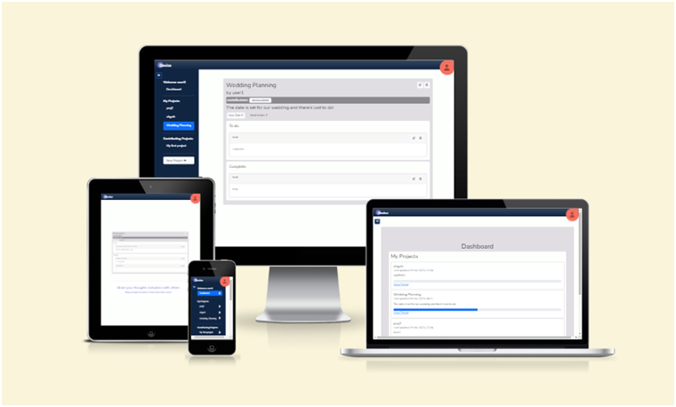

# Devise

- Devise is planner tool designed to help you share your plans with other. Users can invite contributors to their projects or keep them personal.
- Easily navigate between your own projects or projects that others have invited you to.
- Mark tasks as complete when finished and celebrate together!

- This repository hosts the Django Rest Framework API backend of the project. Follow links below to access front end repository.

## Links

[Link to the live project hosted on Heroku (right click to open in new tab)](https://pp5-devise.herokuapp.com/)

[Link to the live backend API render on Heroku (right click to open in new tab)](https://pp5-devise-api.herokuapp.com/)

[Link to the frontend project repository hosted on Github (right click to open in new tab)](https://github.com/BeckySkel/project-5-frontend)

[Link to the backend project repository hosted on Github (right click to open in new tab)](https://github.com/BeckySkel/project-5-backend)

---
## Table of Contents
- [Strategy](https://github.com/BeckySkel/project-5-frontend/blob/main/README.md#strategy)
    - [Target Audience](https://github.com/BeckySkel/project-5-frontend/blob/main/README.md#target-audience)
    - [User Stories](https://github.com/BeckySkel/project-5-frontend/blob/main/README.md#user-stories)
- [Scope](https://github.com/BeckySkel/project-5-frontend/blob/main/README.md#scope)
    - [Research](https://github.com/BeckySkel/project-5-frontend/blob/main/README.md#research)
    - [Future Features](https://github.com/BeckySkel/project-5-frontend/blob/main/README.md#future-features)
    - [Testing](https://github.com/BeckySkel/project-5-frontend/blob/main/README.md#testing)
- [Structure](https://github.com/BeckySkel/project-5-frontend/blob/main/README.md#structure)
    - [Wireframes](https://github.com/BeckySkel/project-5-frontend/blob/main/README.md#wireframes)
    - [Information Architecture](https://github.com/BeckySkel/project-5-frontend/blob/main/README.md#information-architecture)
- [Skeleton](https://github.com/BeckySkel/project-5-frontend/blob/main/README.md#skeleton)
    - [Current Features](https://github.com/BeckySkel/project-5-frontend/blob/main/README.md#current-features)
    - [Technologies Used](https://github.com/BeckySkel/project-5-frontend/blob/main/README.md#technologies-used)
- [Surface](https://github.com/BeckySkel/project-5-frontend/blob/main/README.md#surface)
    - [Design](https://github.com/BeckySkel/project-5-frontend/blob/main/README.md#design)
    - [Deployment](https://github.com/BeckySkel/project-5-frontend/blob/main/README.md#deployment)
- [Credits](https://github.com/BeckySkel/project-5-frontend/blob/main/README.md#credits)
    - [Content](https://github.com/BeckySkel/project-5-frontend/blob/main/README.md#content)
    - [Media](https://github.com/BeckySkel/project-5-frontend/blob/main/README.md#media)
    - [Acknowledgemnets](https://github.com/BeckySkel/project-5-frontend/blob/main/README.md#acknowledgements)

---
## Strategy

### Target Audience
- This site is targeted towards users who would like to organise a project they're working on with others. This will primarily be adults who are comfortbale working with technology and potentially some older teens/students.

- View [User Personas](documents/personas.pdf)

### User Stories

#### Admin
*These are staff/admin users who maintain the site and manage it's contents.*
- [#2](https://github.com/BeckySkel/project-5-frontend/issues/2) As an **admin**, I can **edit and remove projects, tasks and comments** so that **I can manage the site contents**.

#### General Users
*These are any users who visit the site.*
- [#1](https://github.com/BeckySkel/project-5-frontend/issues/1) As a **user**, I can **create an account** so that **I can create and contribute to projects**.
- [#3](https://github.com/BeckySkel/project-5-frontend/issues/3) As a **user**, I can **create my own project(s)** so that **I can plan and track their progress**.
- [#5](https://github.com/BeckySkel/project-5-frontend/issues/5) As a **user**, I can **add and complete tasks** so that **I can keep track of my progress**.
- [#11](https://github.com/BeckySkel/project-5-frontend/issues/11) As a **user**, I can **customise my profile** so that **other users can identify me easily**.
- [#12](https://github.com/BeckySkel/project-5-frontend/issues/12) As a **user**, I can **create a project calendar** so that **I have a visual representation of the timeline**.
- [#15](https://github.com/BeckySkel/project-5-frontend/issues/15) As a **user**, I can **assign due dates to tasks/projects** so that **I know when they need to be completed by**.
- [#16](https://github.com/BeckySkel/project-5-frontend/issues/16) As a **user**, I can **view a dashboard with reminders and updates** so that **I can easily keep track of my different projects/tasks/comments**.

#### Project Owners
*These are users who have created a project and invited others to contribute*
- [#4](https://github.com/BeckySkel/project-5-frontend/issues/4) As a **project owner**, I can **invite others to contribute to my project** so that **we can collaborate on it**.
- [#7](https://github.com/BeckySkel/project-5-frontend/issues/7) As a **project owner**, I can **set the projects visibility to others** so that **I can decide who views it**.
- [#8](https://github.com/BeckySkel/project-5-frontend/issues/8) As a **project owner**, I can **remove collaborators from a project** so that **they can no longer contribute to or view the contents**.
- [#9](https://github.com/BeckySkel/project-5-frontend/issues/9) As a **project owner**, I can **edit the project brief and workspace** so that **it fits my needs**.
- [#10](https://github.com/BeckySkel/project-5-frontend/issues/10) As a **project owner**, I can **remove the tasks and comments within my project** so that **I can manage the contents**.
- [#14](https://github.com/BeckySkel/project-5-frontend/issues/14) As a **project owner**, I can **categorise tasks** so that **I can group and identify them**.

#### Project Contributors
*These are users who have been invited to a project as a contributor*
- [#6](https://github.com/BeckySkel/project-5-frontend/issues/6) As a **project member**, I can **comment and like/vote on added tasks/ideas** so that **I can share my opinion with the team**.
- [#13](https://github.com/BeckySkel/project-5-frontend/issues/13) As a **user**, I can **tag other users in my comments** so that **they are alerted of it**.

Link to [User Stories Kanban Board](https://github.com/users/BeckySkel/projects/4)

---
## Scope

### Research
- Before any planning, I conducted research into a few similar websites to look for inspiration on design and features. This research helped me land on the style and colour theme I chose.

### Future Features

#### ...
- In the future, I'd like to ...

#### ...
- Another helpful feature would be ...

#### ...
- Either inputted by the poster at time of creation or voted on by the community (or both), the recipe could be assigned a difficulty (beginner, intermediate or pro) so that user's can select based on their current abilities. There is currently already a 'Quick & Easy' tag so this could be extended to include other difficulty tags.

#### ...
- Similarly ...

#### ...
- ...

#### ...
- Adding a ...

### Testing
- Throughout the project, I relied heavily on [Chrome Devtools](https://developer.chrome.com/docs/devtools/) to help me view this project on different screen sizes so that I could adjust elements, create media queries (by adding bootstrap classes) for responsive design and debug JavaScript by logging outcomes to the console.
- Code was also run through validators and automatic tests were run through Django
- Please follow [this link](documents/TESTING.md) for full list of tests carried out on this website

---
## Structure

### Wireframes
- After looking at common designs and features and deciding what I would like to include, I mapped out the intended features of the website using [Balsamiq](https://balsamiq.com/) to create wireframes of some of the page views.
- [View the wireframes here](documents/wireframes.pdf)
- The key differences between planning and the final product ...

### Information architecture
- Devise is ...
- Projects are presented ...
- Projects can be ...
- The home page ...
- All pages are responsive thanks to bootstrap classes.
- ...
- Profile pages can be viewed by ...

---
## Skeleton

### Current Features

#### Header & Navbar
- ...

#### Homepage
- Welcomes user and displays either ...
##### Carousel
- ...

##### Dashboard
- ...

##### ...
- ...

##### ...
- ...

#### ...
- ...

#### ...
- ...

#### ...
- ...

#### Edit Profile
- ...

### Technologies used

#### Languages
- [HTML](https://en.wikipedia.org/wiki/HTML)
- [CSS](https://en.wikipedia.org/wiki/CSS)
- [Git](https://en.wikipedia.org/wiki/Git) for version control
- [JavaScript](https://en.wikipedia.org/wiki/JavaScript)
- [Python](https://en.wikipedia.org/wiki/Python_(programming_language))

#### Imported modules
- [os](https://docs.python.org/3/library/os.html)

#### Installed Libraries
- [cloudinary](https://pypi.org/project/cloudinary/)
- [dj3-cloudinary-storage](https://pypi.org/project/dj3-cloudinary-storage/)
- [gunicorn](https://pypi.org/project/gunicorn/)
- [oauthlib](https://pypi.org/project/oauthlib/)
- [psycopg2](https://pypi.org/project/psycopg2/)
- [whitenoise](https://pypi.org/project/whitenoise/)
- [django-crispy-forms](https://pypi.org/project/django-crispy-forms/)

#### Frameworks
- [Django](https://www.djangoproject.com/)

#### Other resources
- [Gitpod](https://www.gitpod.io/) to alter and manage website files
- [Github](https://github.com/) to create and store website files
- [Heroku](https://dashboard.heroku.com/apps) to deploy web application
- [Chrome Devtools](https://developer.chrome.com/docs/devtools/) to test site throughout process
- [Balsamiq](https://balsamiq.com/) to create wireframes
- [Coolors](https://coolors.co/) to choose a colour scheme
- [Bootstrap](https://getbootstrap.com/docs/5.0/getting-started/introduction/) to help with styling and responsive design
- [Cloudinary](https://cloudinary.com/) for database storage
- [Google Fonts](https://fonts.google.com/) for the website font (Nunito)
- [Font Awesome](https://fontawesome.com/) used to add icons
- [Favicon.io](https://favicon.io/favicon-generator/) used to create favicon
- [Code Institute](https://codeinstitute.net/) fullstack developer course to provide learning materials
- [W3Schools](https://www.w3schools.com/) for help with common coding issues
- [Geeks For Geeks](https://www.geeksforgeeks.org/)  for help with common coding issues
- [Stack Overflow](https://stackoverflow.com/) for help with common coding issues
- [Am I Responsive?](https://ui.dev/amiresponsive) for device simulations used in README

---
## Surface

### Design

#### Colour scheme

- The colour-scheme is clear and sharp to compliment the function of the site.
- A complimentary highlight colour has been used sparingly to prevent the site looking too plain. 
- Bootstrap border and background colours were used on  Alerts and secondary features. Bootstrap button colours also used.
- [Coolors](https://coolors.co/) was used to help pick a colour scheme.

#### Imagery
- The only images currently on Devise are the features images within the info carousel. these are screenshots of the app to display the features and layout to new users.

#### Typography
- Nunito is a well balanced sans serif typeface superfamily, with 2 versions: The project began with Nunito, created by Vernon Adams as a rounded terminal sans serif for display typography[*](https://fonts.google.com/specimen/Quicksand/about?query=quicksand). It is clear and well-spaced, making it perfect for an orginsation/planning app. The rounded edges pair well with the playful colours and quirky features of the design.
- Sans serif has been used as the fallback option since it is the closest web-safe font.

#### Icons
- [Font Awesome](https://fontawesome.com/) icons were used for navigation links and action buttons.
---
## Credits

### Content
- Websites used for initial research:
  - [Asana](https://app.asana.com/) for layout and functionality
  - [Toggle Plan](https://toggl.com/plan/index) for design inspiration
- ... [...](...)
- ... [...](...)
- ... [...](...)
- Signals tutorial and code to connect Profile database to User inspired by [https://www.youtube.com/watch?v=Kc1Q_ayAeQk](https://www.youtube.com/watch?v=Kc1Q_ayAeQk)
- ... [...](...)
- ... [...](...)
- Contributors model inspired by [Code Institute](https://codeinstitute.net/) 'I Think Therefore I Blog' walkthrough project.
- ... [...](...)
- Formatting textarea widget from 
- ... [...](...)
- ... [...](...)
- ... [...](...)
- ... [...](...)

### Media
- All icons from [Font Awesome](https://fontawesome.com/)

### Acknowledgements
- [Code Institute](https://codeinstitute.net/) for providing excellent learning content
- Martina Terlevic as my mentor and providing vital feedback throughout the project's development
- [W3Schools](https://www.w3schools.com/) for quick and easy tutorials on programming languages
- [Geeks For Geeks](https://www.geeksforgeeks.org/) for quick and easy tutorials on programming languages
- The users of [Stack Overflow](https://stackoverflow.com/) for asking and answering some of the harder Django questions
- Other CI students for sharing their work and providing inspiration and guidance through the Slack channels

---

Becky Skelcher 2023