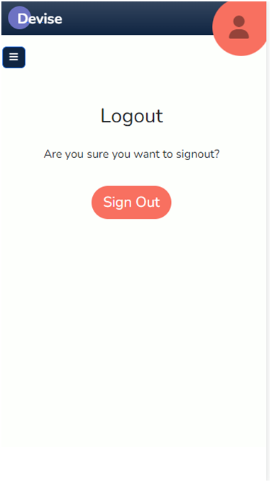

# Devise

- Devise is planner tool designed to help you share your plans with other. Users can invite contributors to their projects or keep them personal.
- Easily navigate between your own projects or projects that others have invited you to.
- Mark tasks as complete when finished and celebrate together!

- This repository hosts the Django Rest Framework API backend of the project. Follow links below to access front end repository.

## Links

[Link to the live project hosted on Heroku (right click to open in new tab)](https://pp5-devise.herokuapp.com/)

[Link to the live backend API render on Heroku (right click to open in new tab)](https://pp5-devise-api.herokuapp.com/)

[Link to the frontend project repository hosted on Github (right click to open in new tab)](https://github.com/BeckySkel/project-5-frontend)

[Link to the backend project repository hosted on Github (right click to open in new tab)](https://github.com/BeckySkel/project-5-backend)

---
## Table of Contents
- [Strategy](https://github.com/BeckySkel/project-5-frontend/blob/main/README.md#strategy)
    - [Target Audience](https://github.com/BeckySkel/project-5-frontend/blob/main/README.md#target-audience)
    - [User Stories](https://github.com/BeckySkel/project-5-frontend/blob/main/README.md#user-stories)
- [Scope](https://github.com/BeckySkel/project-5-frontend/blob/main/README.md#scope)
    - [Research](https://github.com/BeckySkel/project-5-frontend/blob/main/README.md#research)
    - [Future Features](https://github.com/BeckySkel/project-5-frontend/blob/main/README.md#future-features)
    - [Testing](https://github.com/BeckySkel/project-5-frontend/blob/main/README.md#testing)
- [Structure](https://github.com/BeckySkel/project-5-frontend/blob/main/README.md#structure)
    - [Wireframes](https://github.com/BeckySkel/project-5-frontend/blob/main/README.md#wireframes)
    - [Information Architecture](https://github.com/BeckySkel/project-5-frontend/blob/main/README.md#information-architecture)
- [Skeleton](https://github.com/BeckySkel/project-5-frontend/blob/main/README.md#skeleton)
    - [Current Features](https://github.com/BeckySkel/project-5-frontend/blob/main/README.md#current-features)
    - [Technologies Used](https://github.com/BeckySkel/project-5-frontend/blob/main/README.md#technologies-used)
- [Surface](https://github.com/BeckySkel/project-5-frontend/blob/main/README.md#surface)
    - [Design](https://github.com/BeckySkel/project-5-frontend/blob/main/README.md#design)
    - [Deployment](https://github.com/BeckySkel/project-5-frontend/blob/main/README.md#deployment)
- [Credits](https://github.com/BeckySkel/project-5-frontend/blob/main/README.md#credits)
    - [Content](https://github.com/BeckySkel/project-5-frontend/blob/main/README.md#content)
    - [Media](https://github.com/BeckySkel/project-5-frontend/blob/main/README.md#media)
    - [Acknowledgemnets](https://github.com/BeckySkel/project-5-frontend/blob/main/README.md#acknowledgements)

---
## Strategy

### Target Audience
- This site is targeted towards users who would like to organise a project they're working on with others. This will primarily be adults who are comfortbale working with technology and potentially some older teens/students.

- View [User Personas](documents/personas.pdf)

### User Stories

#### Admin
*These are staff/admin users who maintain the site and manage it's contents.*
- [#2](https://github.com/BeckySkel/project-5-frontend/issues/2) As an **admin**, I can **edit and remove projects, tasks and comments** so that **I can manage the site contents**.

#### General Users
*These are any users who visit the site.*
- [#1](https://github.com/BeckySkel/project-5-frontend/issues/1) As a **user**, I can **create an account** so that **I can create and contribute to projects**.
- [#3](https://github.com/BeckySkel/project-5-frontend/issues/3) As a **user**, I can **create my own project(s)** so that **I can plan and track their progress**.
- [#5](https://github.com/BeckySkel/project-5-frontend/issues/5) As a **user**, I can **add and complete tasks** so that **I can keep track of my progress**.
- [#11](https://github.com/BeckySkel/project-5-frontend/issues/11) As a **user**, I can **customise my profile** so that **other users can identify me easily**.
- [#12](https://github.com/BeckySkel/project-5-frontend/issues/12) As a **user**, I can **create a project calendar** so that **I have a visual representation of the timeline**.
- [#15](https://github.com/BeckySkel/project-5-frontend/issues/15) As a **user**, I can **assign due dates to tasks/projects** so that **I know when they need to be completed by**.
- [#16](https://github.com/BeckySkel/project-5-frontend/issues/16) As a **user**, I can **view a dashboard with reminders and updates** so that **I can easily keep track of my different projects/tasks/comments**.

#### Project Owners
*These are users who have created a project and invited others to contribute*
- [#4](https://github.com/BeckySkel/project-5-frontend/issues/4) As a **project owner**, I can **invite others to contribute to my project** so that **we can collaborate on it**.
- [#7](https://github.com/BeckySkel/project-5-frontend/issues/7) As a **project owner**, I can **set the projects visibility to others** so that **I can decide who views it**.
- [#8](https://github.com/BeckySkel/project-5-frontend/issues/8) As a **project owner**, I can **remove collaborators from a project** so that **they can no longer contribute to or view the contents**.
- [#9](https://github.com/BeckySkel/project-5-frontend/issues/9) As a **project owner**, I can **edit the project brief and workspace** so that **it fits my needs**.
- [#10](https://github.com/BeckySkel/project-5-frontend/issues/10) As a **project owner**, I can **remove the tasks and comments within my project** so that **I can manage the contents**.
- [#14](https://github.com/BeckySkel/project-5-frontend/issues/14) As a **project owner**, I can **categorise tasks** so that **I can group and identify them**.

#### Project Contributors
*These are users who have been invited to a project as a contributor*
- [#6](https://github.com/BeckySkel/project-5-frontend/issues/6) As a **project member**, I can **comment and like/vote on added tasks/ideas** so that **I can share my opinion with the team**.
- [#13](https://github.com/BeckySkel/project-5-frontend/issues/13) As a **user**, I can **tag other users in my comments** so that **they are alerted of it**.

Link to [User Stories Kanban Board](https://github.com/users/BeckySkel/projects/4)

---
## Scope

### Research
- Before any planning, I conducted research into a few similar websites to look for inspiration on design and features. This research helped me land on the style and colour theme I chose.

### Future Features

- Unfortunately, I did not manage to fulfill all my user stories so some planned features for the future would be:

#### Add Due Date to Projects and Tasks
- In the future, I'd like to include due dates to help the user(s) plan their time and set deadlines.

#### Privacy Control
- Another helpful feature would be to allow users the option to share their plans witha wider audience if they choose. Permissions could be set per project as Everyone, Connections only, Me only.

#### Add Comments and Votes/Likes
- Users could comment on tasks to track progress and development and up/down vote ideas.

#### Comment Tags
- If comments were included, user's could tag one another to draw attention to a task/project.

#### Manage Comments
- Project creators would be able to manage comments.

#### Custom Categories
- Adding custom categories to extend the "To do" and "complete" options would allow users to track tasks at all stages of the project.

#### Calendar
- Calendar tools are a popular and useful feature on planning apps and would be a welcome addition.

### Testing
- Throughout the project, I relied heavily on [Chrome Devtools](https://developer.chrome.com/docs/devtools/) to help me view this project on different screen sizes so that I could adjust elements, create media queries (by adding bootstrap classes) for responsive design and debug JavaScript by logging outcomes to the console.
- Code was also run through validators and automatic tests were run through Django
- Please follow [this link](documents/TESTING.md) for full list of tests carried out on this website

---
## Structure

### Wireframes
- After looking at common designs and features and deciding what I would like to include, I mapped out the intended features of the website using [Balsamiq](https://balsamiq.com/) to create wireframes of some of the page views.
- [View the wireframes here](documents/wireframes.pdf)
- The key differences between planning and the final product are the lack of footer and the layout of the task containers. The footer didn't feel necessary and the task containers fit better as a cow than columns.

### Information architecture
- Devise is a planning app made up of 6 main views: Homepage, Dashboard, Login, Logout, Register and Project
- Projects are presented as full-pages and contain multiple tasks.
- Projects can be created, edited and deleted via the create/edit form.
- Tasks can be created, edited and deleted from the project page.
- The home page is dynamic and displays either an information carousel or dashboard, depending on the users logged in state.
- All pages are responsive thanks to bootstrap classes.
- Profile info can be viewed by small popovers when hovering over a user's username. 

---
## Skeleton

### Current Features

#### Header
- The header is simple but elegant with a fun pop of colour.
- Clicking the Devise logo takes the user to the homepage/dashboard (depending on logged in state)
- The account menu is displayed in a circle which extends when hovered over. The contents is either "Lgoin" and "Register" when logged out or "Logout" and "Edit Profile" when logged in.

#### Sidebar
- Displayed on the left-hand side of the screen
- pushes main content to the side on larger screens and hides it on smaller
- Autoclose when clicked out of on smaller screens but static on larger
- Provides project navigation

#### Homepage
- Displays either the information carousel or dashboard depending if user is logged in

##### Carousel
- The carousel features 2 screenshots of the app with shorts nisppets of information about app features.

##### Dashboard
- The dashboard shows logged in users their curent projects witha bit of information about progress as well as displaying the description

##### Login
- The login page consists of a simple form
- Option to folow link to registration if user does not yet have an acount
- Redirected to homepage on successful login

##### Register
- Similar to the login form, the register form is fairly simple and displays a link to the login form
- User is informormed that they need to verify their email before continuing after successful submission

#### Logout
- If user clicks the logout option in the account menu, they are redirected to confirm logout

#### Profile Edit
- Users have the ability to edit their profile so that others can identify them easily
- All fields are optional

#### Project
- A single project is displayed with information about the creator, contributors, title and description
- Tasks are then displayed in "To do" and "Complete" containers
- Project edit is displayed as a pop-up modal over the current project

#### Tasks
- Tasks are cards that can be dragged and dropped from one container to another to set the state as To do or Complete
- They are editable via a pop-up modal
- If the site were to grow, they could be used again for Subtasks or commenting

#### Avatars
- Avatars are buttons displaying user profile information when hoevered over
- Although they are currently only present on the project view page, they could be easily incorporated anywhere that usernames appear to provide other users some insight into the users profile

#### Modals
- Modals have been reused throughout the site to display create, edit and deletion forms, as well as confirmation when a user wants to leave a project

### Reusable Components
- axiosDefault.js for ease of communication with the backend API.
- CreateEditModal.js used to display the create/edit project/task forms
- DeleteModal.js used to confirm deletion of a project/task
- LeaveProjectModal.js used to confirm when a user tries to leave a project
- Avatar.js to display more information about the user when hovered over
- InfoCarousel.js currently only used on logged-out homepage but could be included to display other information inthe carousel format
- Loading.js to display a spinner when loading
- ToastAlerts.js displays error alerts to the user on any screen where errors may occur
- CurrentUserContext.js to confirm users logged-in status make their user info available.
- ErrorContext.js used to call the display errors through ToastAlerts.js
- ViewportContext.js to update components based on viewport size
- ProjectCard.js used on dashboard to display user's projects with useful information
- Task.js used within project to display relevant tasks
- TaskContainer.js used within project to contain task cards

### Technologies used

#### Languages
- [HTML](https://en.wikipedia.org/wiki/HTML)
- [CSS](https://en.wikipedia.org/wiki/CSS)
- [Git](https://en.wikipedia.org/wiki/Git) for version control
- [JavaScript](https://en.wikipedia.org/wiki/JavaScript)
- [Python](https://en.wikipedia.org/wiki/Python_(programming_language))

#### Imported modules
- [os](https://docs.python.org/3/library/os.html)

#### Installed Libraries
##### Python
- [cloudinary](https://pypi.org/project/cloudinary/) for database storage
- [dj3-cloudinary-storage](https://pypi.org/project/dj3-cloudinary-storage/) for database storage
- [gunicorn](https://pypi.org/project/gunicorn/) for hosting
- [oauthlib](https://pypi.org/project/oauthlib/) for user authentication
- [psycopg2](https://pypi.org/project/psycopg2/) to comunicate with database

##### Javascript
- [slugify]() to slugify container titles
- [react-bootstrap]() for styling
- [Patchstyles]() for easily applying module styles

#### Frameworks
- [Django](https://www.djangoproject.com/)

#### Other resources
- [Gitpod](https://www.gitpod.io/) to alter and manage website files
- [Github](https://github.com/) to create and store website files
- [Heroku](https://dashboard.heroku.com/apps) to deploy web application
- [Chrome Devtools](https://developer.chrome.com/docs/devtools/) to test site throughout process
- [Balsamiq](https://balsamiq.com/) to create wireframes
- [Coolors](https://coolors.co/) to choose a colour scheme
- [Bootstrap](https://getbootstrap.com/docs/5.0/getting-started/introduction/) to help with styling and responsive design
- [Cloudinary](https://cloudinary.com/) for database storage
- [Google Fonts](https://fonts.google.com/) for the website font (Nunito)
- [Font Awesome](https://fontawesome.com/) used to add icons
- [Favicon.io](https://favicon.io/favicon-generator/) used to create favicon
- [Code Institute](https://codeinstitute.net/) fullstack developer course to provide learning materials
- [W3Schools](https://www.w3schools.com/) for help with common coding issues
- [Geeks For Geeks](https://www.geeksforgeeks.org/)  for help with common coding issues
- [Stack Overflow](https://stackoverflow.com/) for help with common coding issues
- [Am I Responsive?](https://ui.dev/amiresponsive) for device simulations used in README

---
## Surface

### Design

#### Colour scheme

- The colour-scheme is clear and sharp to compliment the function of the site.
- A complimentary highlight colour has been used sparingly to prevent the site looking too plain. 
- Bootstrap border and background colours were used on  Alerts and secondary features. Bootstrap button colours also used.
- [Coolors](https://coolors.co/) was used to help pick a colour scheme.

#### Imagery
- The only images currently on Devise are the features images within the info carousel. these are screenshots of the app to display the features and layout to new users.

#### Typography
- Nunito is a well balanced sans serif typeface superfamily, with 2 versions: The project began with Nunito, created by Vernon Adams as a rounded terminal sans serif for display typography[*](https://fonts.google.com/specimen/Quicksand/about?query=quicksand). It is clear and well-spaced, making it perfect for an orginsation/planning app. The rounded edges pair well with the playful colours and quirky features of the design.
- Sans serif has been used as the fallback option since it is the closest web-safe font.

#### Icons
- [Font Awesome](https://fontawesome.com/) icons were used for navigation links and action buttons.

### Deployment
- This site was developed using [Gitpod](https://www.gitpod.io/), stored on [Github](https://github.com/) and deployed with [Heroku](https://dashboard.heroku.com/apps).

- Creating the React App:
    1. Create new repository and launch in Gitpod
    2. Install ReactJS: npx create-react-app . --use-npm, npm start
    3. Install packages from list below with "pip3 install"
        - react-bootstrap@1.6.3 bootstrap@4.6.0
        - react-router-dom@5.3.0
        - axios
        - bootstrap
        - jwt-decode
        - patch-styles
        - prop-types
        - react-infinite-scroll-component
        - react-slugify
    4. Create an axiosDefaults.js file and add the following code:
        axios.defaults.baseURL = "https://REACT-APP-NAME.herokuapp.com"
        axios.defaults.headers.post["Content-Type"] = "multipart/form-data"
        axios.defaults.withCredentials = true
    5. Create Procfile and populate with below code:
        web: serve -s build
    6. Add below code to scripts section of package.json file:
        "heroku-prebuild": "npm install -g serve",

- Connecting to DRF backend:
    1. Add the following config vars to your DRF app in Heroku:
        - CLIENT_ORIGIN: https://REACT-APP-NAME.herokuapp.com
        - CLIENT_ORIGIN_DEV: https://GITPOD-WORKSPACE-LINK.ws-eu54.gitpod.io

- Debugging in Gitpod:
    1. In the terminal, type "npm start" and press enter to begin the application
    2. Click "Open in Browser" on the pop-up
    3. Once finished, use Ctrl + C in the terminal to close the application

- Deploying to Heroku:
    1. From the homescreen, click "New" and select "Create new app"
    2. Choose app name, select region and click "Create"
    3. Add heroku/node.js buildpack
    5. Go to "Deploy" and connect Github repository
    6. Select "Enable Automatic Deploys" and click "Deploy Branch"

---
## Credits

### Content
- Websites used for initial research:
  - [Asana](https://app.asana.com/) for layout and functionality
  - [Toggle Plan](https://toggl.com/plan/index) for design inspiration
- During test I found it helpful to hide POST/PUT forms when not authenticated, code used to hide forms at [https://forum.djangoproject.com/t/django-rest-framework-404-not-found-put-delete/7980](https://forum.djangoproject.com/t/django-rest-framework-404-not-found-put-delete/7980)
- Signals tutorial and code to connect Profile database to User inspired by [https://www.youtube.com/watch?v=Kc1Q_ayAeQk](https://www.youtube.com/watch?v=Kc1Q_ayAeQk)
- Code for the current user serializer from the Moments CI walkthrough project [Code Institute](https://codeinstitute.net/)
- Contributors model inspired by Followers model in Moments CI walkthrough project [Code Institute](https://codeinstitute.net/) 
- Help with updating email templates from [https://medium.com/@etentuk/django-rest-framework-how-to-edit-reset-password-link-in-dj-rest-auth-with-dj-allauth-installed-c54bae36504e](https://medium.com/@etentuk/django-rest-framework-how-to-edit-reset-password-link-in-dj-rest-auth-with-dj-allauth-installed-c54bae36504e)
- Help with registration endpoints [https://dev.to/willp11/django-part-3-user-authentication-with-dj-rest-auth-and-allauth-4dih](https://dev.to/willp11/django-part-3-user-authentication-with-dj-rest-auth-and-allauth-4dih)
- root_route and logout_route views kindly provided by Moments CI walkthrough project [Code Institute](https://codeinstitute.net/)

### Acknowledgements
- [Code Institute](https://codeinstitute.net/) for providing excellent learning content
- Martina Terlevic as my mentor and providing vital feedback throughout the project's development
- [W3Schools](https://www.w3schools.com/) for quick and easy tutorials on programming languages
- [Geeks For Geeks](https://www.geeksforgeeks.org/) for quick and easy tutorials on programming languages
- The users of [Stack Overflow](https://stackoverflow.com/) for asking and answering some of the harder Django questions
- Other CI students for sharing their work and providing inspiration and guidance through the Slack channels

---

Becky Skelcher 2023