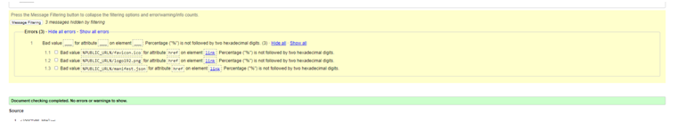
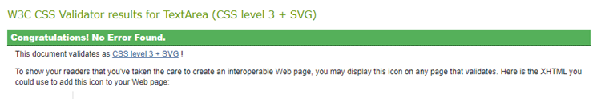

# Website Testing

## HTML and CSS Validation Testing

- All pages were passed through either the [W3C CSS validator](https://jigsaw.w3.org/css-validator/), [W3C HTML Validator](https://validator.w3.org/nu/), or Github's local pycodestyle PROBLEMS tab (depending on relevance).
- Any issues found have been rectified and all pages now pass with no errors to show. Any warnings received explained below.

###  W3C HTML Validator (Validate by URI)

#### index.html
- 3 errors returned as a results of React link format, otherwise all ok.

###  W3C CSS Validator (Validate by direct input)

- The below css files were combined and validated together.
  - App.module.css
  - SideBar.module.css
  - Project.module.css
  - NavBar.module.css
  - InfoCarousel.module.css
  - Forms.module.css
  - Error.module.css

###  Prettier - Code Formatter
- JSX code formatted using prettier.

---
## Lighthouse
- All pages were ran through Lighthouse on Chrome Devtools for both desktop and mobile device display. Ran in incognito mode. Any issues were dealt with and all now have a high passing mark with any exceptions detailed in linked documents.

### Desktop
- Click [here](dcuments/desktop-lighthouse-testing.pdf) to see Lighthouse scores on desktop

### Mobile
- Click [here](documents/mobile-lighthouse-testing.pdf) to see Lighthouse scores on mobile

---
## Manual testing

### Homepage and Dashboard (https://pp5-devise.herokuapp.com/)
- All internal links tested manually on **29/3/23** and found to be working as intended
- No external links to test
- All dynamic content tested manually on **29/3/23** and found to be working as intended
- All login-state sensitive content and links tested manually on **29/3/23** and found to be working as intended

#### Login (https://pp5-devise.herokuapp.com/login)
- All internal links tested manually on **29/3/23** and found to be working as intended
- No external links to test
- Form tested manually on **29/3/23** and found to be working as intended

#### Logout (https://pp5-devise.herokuapp.com/logout)
- All internal links tested manually on **29/3/23** and found to be working as intended
- No external links to test

#### Register (https://pp5-devise.herokuapp.com/register)
- All internal links tested manually on **29/3/23** and found to be working as intended
- No external links to test
- Form tested manually on **29/3/23** and found to be working as intended

#### Edit Profile (https://pp5-devise.herokuapp.com/edit-profile)
- Form tested manually on **29/3/23** and found to be working as intended
- All dynamic content tested manually on **29/3/23** and found to be working as intended

#### 404 Error (https://pp5-devise.herokuapp.com/404)
- All internal links tested manually on **29/3/23** and found to be working as intended
- All dynamic content tested manually on **29/3/23** and found to be working as intended

#### 500 Error (https://pp5-devise.herokuapp.com/500)
- All internal links tested manually on **29/3/23** and found to be working as intended
- All dynamic content tested manually on **29/3/23** and found to be working as intended

---
## Different browsers
- Tested and found to be working as intended on the following browsers:
    - Chrome
    - Firefox
    - Microsoft Edge
- Unable to test on Safari as unble to download on my Windows PC
- Certain features are not supported on Internet Explorer and therefore some feature are not displaying properly. However, Internet Explorer was retired by Microsoft in August 2021 and is no longer supported.

---
## Different devices with Chrome Devtools
- Tested on the following devices via Chrome Devtools and found to be working as intended:
    - iPhone SE
    - iPhone XR
    - iPhone 12 Pro
    - Pixel 5
    - Samsung Galaxy S8+
    - Samsung Galaxy S20 Ultra
    - iPad Air
    - iPad Mini
    - Surface Pro 7
    - Surface Duo 
    - Samsung Galaxy A51/71
    - Nest Hub
    - Nest Hub Max

---
## Media Queries
- Media queries were provided by Bootstrap and introduced at the below break points:
    - xs 0px
    - s 576px
    - m 768px
    - l 992px
    - xl 1200px
    - xxl 1400px

---
## Bugs
### Resolved Bugs
- ...
- ...

### Unresolved Bugs
- none identified.
